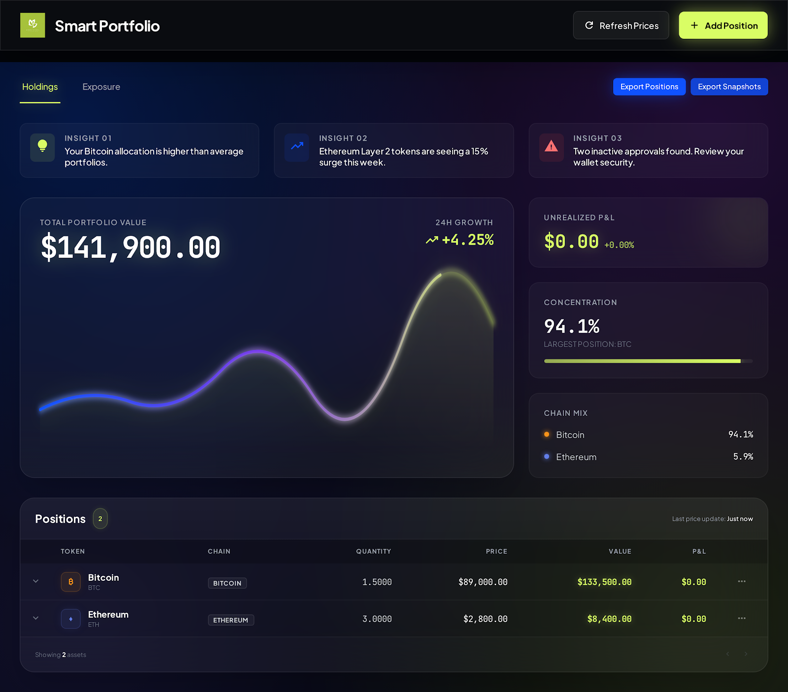

# Smart Portfolio

**Crypto portfolio risk analytics — correlation matrices, volatility scoring, drawdown analysis, and scenario stress-testing for active investors and crypto-native funds.**



> **Status:** Originally built and deployed as a [Hyperware](https://hyperware.ai) app. With Hyperware being decommissioned, the app is being ported to a standalone deployment (React frontend + lightweight API). This repo contains the original Rust backend and the React UI; the migration in progress strips the Hyperware-specific layer while preserving the analytics engine.

## What it does

Smart Portfolio is the kind of tool a crypto VC associate or active investor builds in spreadsheets — but actually built. Add positions manually or by scanning an EVM wallet, and the app continuously computes:

- **Live P&L** across positions with prices from CoinGecko, DeFi Llama, and Dexscreener
- **Concentration & exposure** by chain (Ethereum, Solana, Bitcoin, etc.) and by underlying asset (ETH, BTC, stablecoins, other)
- **Portfolio risk score** rolled up from per-asset volatility, correlation, and drawdown
- **Correlation matrix** using Pearson coefficients across the portfolio
- **Annualized volatility** scored at 7-day and 30-day windows per asset
- **Drawdown analysis** — current and max over rolling 30-day windows
- **Scenario stress tests** — crypto winter, bull run, ETH rally, stablecoin depeg
- **Actionable recommendations** prioritized by impact (rebalance, sell, buy, alert)
- **Real-time crypto news** per held asset via CryptoPanic
- **Wallet import** across 7 EVM chains (Ethereum, Arbitrum, Optimism, Base, Polygon, Avalanche, BNB) via Moralis

All quant — Pearson correlation, volatility scoring, drawdown windows, scenario impact — runs in Rust on the backend. ~4,200 lines, with a 60-second risk-metrics cache to avoid burning API quota.

## Architecture

```
smart-portfolio/
├── smart-portfolio/        # Rust backend (~4,200 LOC, compiles to WASM)
│   └── src/lib.rs          # Risk math, API integrations, state, HTTP routing
├── ui/                     # React 18 + TypeScript + Zustand + Vite
│   └── src/
│       ├── components/     # 22 components (risk, exposure, recommendations, charts)
│       ├── store/          # Zustand store
│       └── types/          # Shared types
├── docs/                   # API.md, ARCHITECTURE.md, SETUP.md, DEVELOPMENT.md
└── pkg/                    # Built Hyperware package (legacy)
```

**Data sources**
- CoinGecko — prices, market caps, 24h changes
- DeFi Llama — chain TVL, historical prices
- Dexscreener — DEX prices and liquidity for newer tokens
- CryptoPanic Developer API v2 — real-time news and sentiment
- Moralis Web3 Data API — multi-chain wallet token balances

**Risk module** (`smart-portfolio/src/lib.rs`)
- `pearson_correlation` — pairwise asset correlation
- `calculate_volatility` — annualized stdev of returns
- `calculate_drawdown_metrics` — current + max drawdown over rolling window
- `calculate_risk_metrics` — portfolio-level rollup (0–100 score)
- `calculate_scenarios` — applies named macro scenarios to current weights
- `generate_actionable_recommendations` — prioritized output with impact estimates

## Migration off Hyperware (in progress)

Hyperware is being decommissioned, so this app is being moved to a standalone stack:

- **Frontend** — React + Vite, deployed to Vercel (no changes to component logic)
- **Backend** — porting from `hyperware_process_lib` to **axum** (Rust) on Fly.io, *or* a TypeScript rewrite on Hono running on Railway. The pure-math functions port cleanly either way.
- **Persistence** — moving from Hyperware's local KV to Supabase (Postgres)
- **API layer** — same REST surface, same response shapes — UI requires no changes beyond the base URL

Live demo URL coming once the cutover ships.

## Tech stack

**Backend (current — Hyperware)**
- Rust, WebAssembly (WASM), `hyperware_process_lib`, serde, `rust_decimal` for precise arithmetic

**Frontend**
- React 18, TypeScript, Zustand, Recharts, Vite

## Documentation

- [API Reference](docs/API.md) — REST API surface
- [Architecture](docs/ARCHITECTURE.md) — system design and data flow
- [Setup Guide](docs/SETUP.md) — running the legacy Hyperware build
- [Development Guide](docs/DEVELOPMENT.md) — extending the codebase
- [Changelog](CHANGELOG.md) — version history

## Running the legacy Hyperware build

> Kept here for reference; will be replaced when the standalone build lands.

**Prerequisites**
- [Hyperware Kit](https://github.com/hyperware-ai/kit)
- Rust toolchain with `wasm32-wasip1` target
- Node.js 18+

```bash
kit build
kit boot-fake-node
kit start-package
```

App at `http://localhost:8080/smart-portfolio:smart-portfolio:template.os/`

CoinGecko API key is set at runtime:
```bash
curl -X POST http://localhost:8080/smart-portfolio:smart-portfolio:template.os/api/config \
  -H "Content-Type: application/json" \
  -d '{"api_key": "your-coingecko-api-key"}'
```

## Privacy & security

- Local-first storage (Hyperware node KV; Supabase row-level-security in the migrated build)
- No analytics or telemetry
- Input validation on all user-supplied fields
- CSV exports follow RFC 4180 with injection prevention
- 60-second TTL on price + risk caches to bound API usage

## License

MIT — see [LICENSE](LICENSE).
